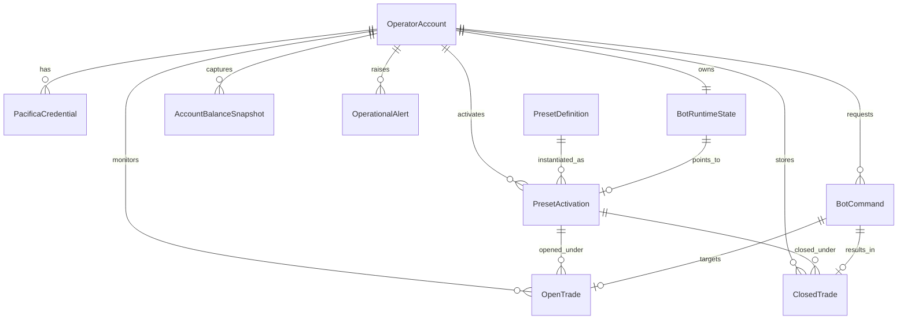
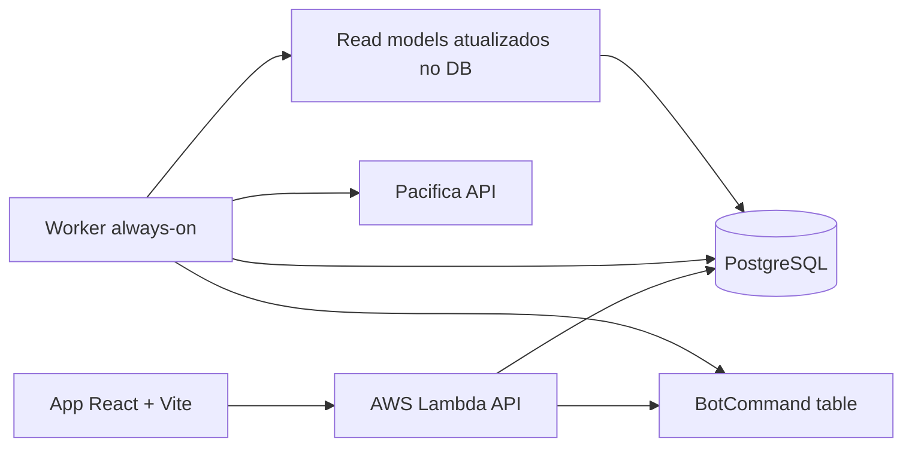
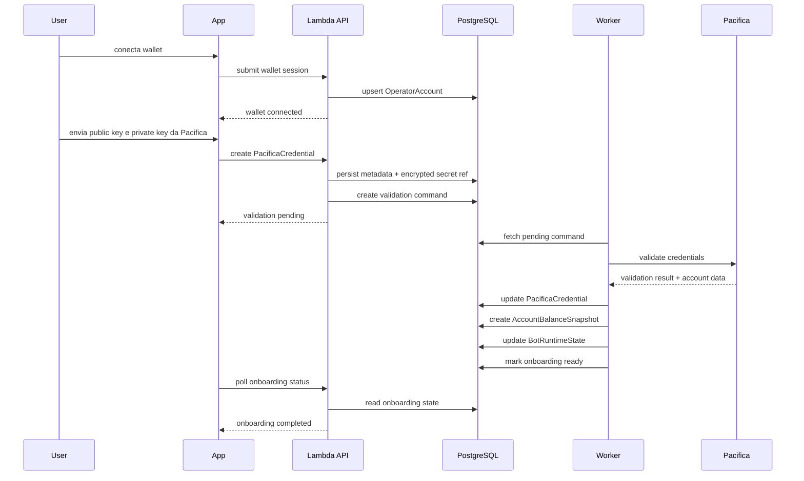
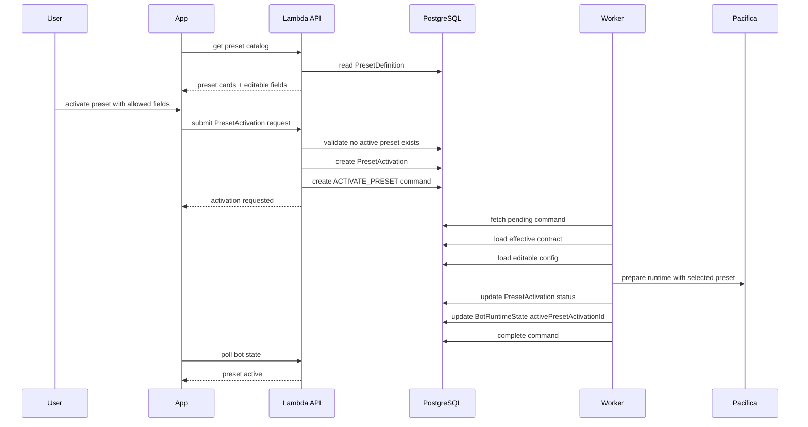
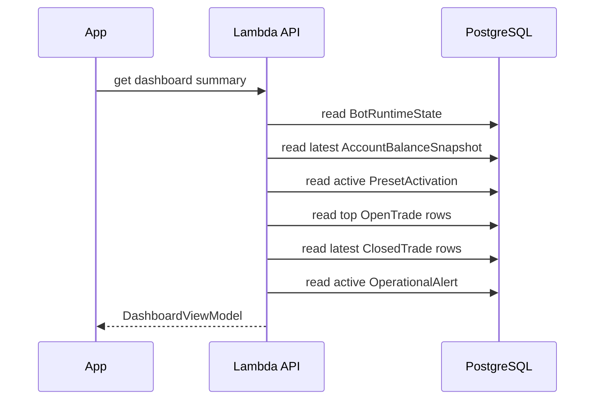
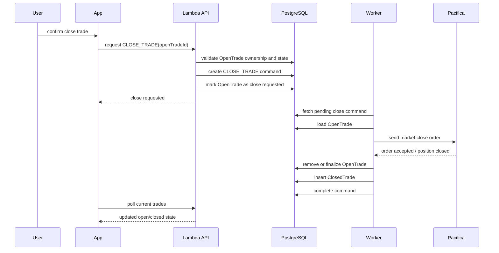
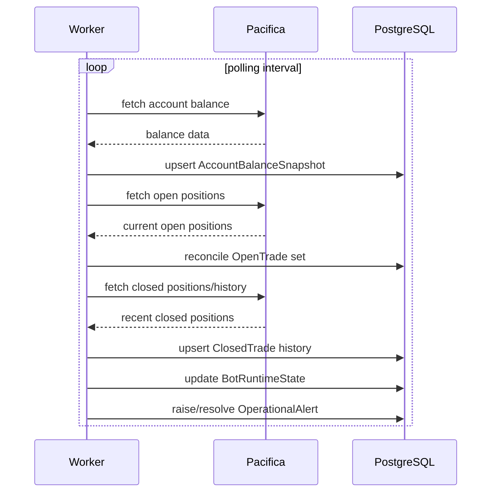
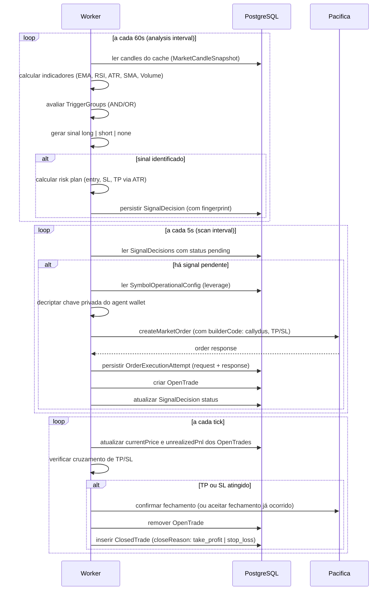
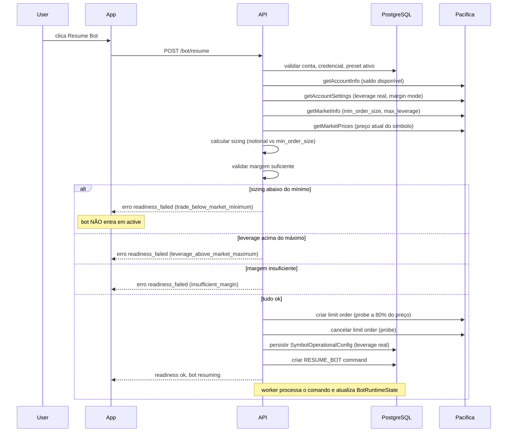

# Modelagem de Dados e Fluxos do Produto

> **Status:** documento fundacional — reflete o design inicial do MVP. Entidades, fluxos e decisões foram evoluídos desde então. Consulte `RELATIONAL_DATA_MODEL.pt-BR.md` para o schema atual completo. Este documento mantém seu valor como referência histórica de decisões de modelagem e como base dos fluxos principais ainda válidos.

## Objetivo
Definir a modelagem inicial de dados do MVP e os fluxos principais entre interface, API, worker, banco e Pacifica, para servir de base aos contratos, ao schema do banco e à implementação.

## Escopo
Este documento cobre:
- entidades de negócio do MVP
- relacionamentos principais
- fluxos de leitura e escrita
- sequência dos eventos mais sensíveis
- suposições explícitas que ainda precisam ser fechadas

## Leitura do Produto
Pelo material de produto e pela direção atual do projeto, o MVP precisa sustentar estes comportamentos:
- onboarding com wallet Solana e credenciais Pacifica
- armazenamento altamente seguro das credenciais da Pacifica, incluindo material sensível associado a private keys
- ativação de um preset por conta
- edição apenas dos campos permitidos no lock de escopo: `symbol`, `position size`, `long enabled`, `short enabled`
- leitura contínua de estado operacional
- monitoramento de trades abertos
- fechamento manual de trade específico
- histórico cronológico de trades encerrados
- pausa e retomada do bot sem perder o contexto operacional

## Direção Confirmada para o MVP
Neste momento, o modelo oficial do MVP é:
- uma conta pode ter apenas um preset ativo por vez
- a ativação do preset expõe apenas os campos editáveis definidos no `MVP_SCOPE_LOCK`
- `risk` permanece como atributo de leitura do preset, não como campo editável no MVP
- expansão para múltiplos presets ativos fica para versões futuras
- credenciais Pacifica devem ser tratadas como segredo de alta criticidade

## Princípio de Modelagem
A modelagem não deve reproduzir a Pacifica diretamente.

Devemos manter dois níveis de representação:
- modelo de integração: próximo da Pacifica, isolado no worker
- modelo de produto: estável, legível e orientado às telas do MVP

## Entidades Principais

### 1. OperatorAccount
Representa o contexto principal do operador no produto.

Responsabilidades:
- identificar o operador no sistema
- consolidar estado de onboarding
- servir como raiz lógica da conta operada

Campos iniciais sugeridos:
- `id`
- `walletAddress`
- `onboardingStatus`
- `createdAt`
- `updatedAt`

### 2. PacificaCredential
Representa a credencial operacional da Pacifica vinculada ao operador.

Responsabilidades:
- armazenar referência segura à credencial
- registrar resultado da última validação
- controlar disponibilidade operacional da integração
- manter segregação entre metadados persistidos e segredo criptografado

Campos iniciais sugeridos:
- `id`
- `operatorAccountId`
- `credentialAlias`
- `publicKey`
- `encryptedPrivateKeyRef`
- `keyFingerprint`
- `validationStatus`
- `lastValidatedAt`
- `lastValidationErrorCode`
- `createdAt`
- `updatedAt`

### 3. BotRuntimeState
Representa o estado atual consolidado do bot para a conta.

Responsabilidades:
- informar se o bot está ativo, pausado, em erro ou sincronizando
- manter snapshot operacional para Dashboard e topbar
- refletir qual preset está ativo no momento

Campos iniciais sugeridos:
- `id`
- `operatorAccountId`
- `botStatus`
- `pacificaConnectionStatus`
- `syncStatus`
- `activePresetActivationId`
- `lastHeartbeatAt`
- `lastErrorMessage`
- `updatedAt`

### 4. PresetDefinition
Representa um dos presets fixos do MVP.

Responsabilidades:
- guardar contrato base da estratégia
- expor rótulos de leitura como risco e frequência
- separar preset final do estado ativado

Campos iniciais sugeridos:
- `id`
- `name`
- `slug`
- `version`
- `riskLabel`
- `frequencyLabel`
- `description`
- `baseContract`
- `isActive`

### 5. PresetActivation
Representa uma ativação concreta de preset para a conta.

Responsabilidades:
- registrar qual preset foi escolhido
- persistir apenas a configuração operacional editável do MVP
- permitir auditoria do que estava ativo em cada momento

Campos iniciais sugeridos:
- `id`
- `operatorAccountId`
- `presetDefinitionId`
- `activationStatus`
- `symbol`
- `positionSizeType`
- `positionSizeValue`
- `longEnabled`
- `shortEnabled`
- `editableConfig`
- `effectiveContract`
- `activatedAt`
- `deactivatedAt`
- `createdBy`

### 6. BotCommand
Representa uma intenção operacional enviada pelo usuário ou sistema.

Responsabilidades:
- desacoplar API do worker
- permitir execução assíncrona e auditável
- registrar sucesso, falha e idempotência

Campos iniciais sugeridos:
- `id`
- `operatorAccountId`
- `commandType`
- `targetType`
- `targetId`
- `payload`
- `requestedBy`
- `commandStatus`
- `idempotencyKey`
- `requestedAt`
- `startedAt`
- `finishedAt`
- `failureReason`

### 7. OpenTrade
Representa um trade atualmente aberto na conta.

Responsabilidades:
- suportar monitoramento imediato
- alimentar Dashboard e tela de Trades Atuais

Campos iniciais sugeridos:
- `id`
- `operatorAccountId`
- `pacificaTradeId`
- `presetActivationId`
- `symbol`
- `side`
- `entryPrice`
- `currentPrice`
- `quantity`
- `capitalAllocated`
- `unrealizedPnl`
- `tradeStatus`
- `openedAt`
- `closeRequestedAt`
- `closeReasonPending`
- `isPlatformTrade`
- `lastSyncedAt`

### 8. ClosedTrade
Representa um trade encerrado e pronto para leitura histórica.

Responsabilidades:
- suportar leitura cronológica simples
- registrar resultado e motivo de encerramento
- separar histórico de operação atual

Campos iniciais sugeridos:
- `id`
- `operatorAccountId`
- `pacificaTradeId`
- `presetActivationId`
- `symbol`
- `side`
- `entryPrice`
- `exitPrice`
- `quantity`
- `capitalAllocated`
- `realizedPnl`
- `closeReason`
- `openedAt`
- `closedAt`
- `isPlatformTrade`
- `closedByCommandId`
- `lastSyncedAt`

### 9. AccountBalanceSnapshot
Representa o snapshot de saldo para leitura rápida.

Responsabilidades:
- alimentar topbar e Dashboard
- evitar dependência de cálculo no frontend

Campos iniciais sugeridos:
- `id`
- `operatorAccountId`
- `totalBalance`
- `availableBalance`
- `aggregatedPnl`
- `capitalInUse`
- `capturedAt`

### 10. OperationalAlert
Representa mensagens operacionais relevantes para o MVP.

Responsabilidades:
- expor alertas simples no Dashboard
- sinalizar falhas de sync, reconciliação ou execução

Campos iniciais sugeridos:
- `id`
- `operatorAccountId`
- `alertType`
- `severity`
- `title`
- `message`
- `isActive`
- `createdAt`
- `resolvedAt`

### 11. YourStrategy
Estratégia customizada criada do zero pelo usuário. Máximo de 1 por conta.

Responsabilidades:
- persistir o estado do builder em edição (`draftJson`)
- materializar o `PresetTechnicalContract` quando o draft for válido
- registrar blockers de ativação e fingerprint do último backtest

Campos principais:
- `id`
- `operatorAccountId` (unique — 1 por conta)
- `draftJson` (estado atual do builder)
- `materializedContractJson` (contrato gerado do draft válido)
- `activationBlockersJson`
- `lastBacktestPreviewedAt`
- `lastBacktestPreviewFingerprint`

### 12. SignalDecision
Decisão de sinal gerada pelo motor de estratégia com risk plan completo.

Responsabilidades:
- registrar que um sinal foi identificado (long/short)
- guardar entry, stop loss e take profit calculados
- servir de base para a tentativa de execução de ordem
- garantir deduplicação via `signalFingerprint`

Campos principais:
- `id`, `operatorAccountId`, `presetActivationId`
- `signalFingerprint` (deduplicação)
- `decisionStatus`
- `signalSide`, `symbol`, `timeframe`
- `entryReferencePrice`, `stopLossPrice`, `takeProfitPrice`, `riskDistance`
- `candleOpenTime`, `candleCloseTime`

### 13. OrderExecutionAttempt
Tentativa de envio de ordem para a Pacifica.

Responsabilidades:
- registrar o request e response de cada tentativa de ordem
- rastrear status de execução e falhas com retryable flag
- linkar ao `SignalDecision` que originou a ordem

Campos principais:
- `id`, `operatorAccountId`, `presetActivationId`, `signalDecisionId`
- `executionStatus`, `clientOrderId` (unique)
- `requestedNotionalUsd`, `requestedQuantity`
- `entryReferencePrice`, `slippagePercent`
- `requestJson`, `responseJson`, `failureReason`
- `pacificaOrderId`

### 14. SymbolOperationalConfig
Configuração operacional por símbolo por conta, gravada pelo readiness check.

Responsabilidades:
- persistir leverage real da conta para o símbolo
- permitir ao worker calcular sizing sem chamar a Pacifica a cada ciclo
- ser atualizada a cada `StartBotReadinessCheck` bem-sucedido

Campos principais:
- `id`, `operatorAccountId`, `symbol`
- `leverage`

## Relacionamentos Principais

## Observações de Relacionamento
- `PresetDefinition` é catálogo estático do MVP.
- `PresetActivation` é histórico operacional do que ficou ativo para a conta.
- o MVP permite apenas uma `PresetActivation` em estado ativo por conta.
- `OpenTrade` e `ClosedTrade` são separados no modelo de produto para simplificar leitura, telas e performance.
- `BotCommand` é a fronteira principal para comandos sensíveis.
- `AccountBalanceSnapshot` pode ser tabela de snapshots ou tabela de estado atual, dependendo da necessidade de histórico financeiro do MVP.

## Fluxo de Dados em Alto Nível

## Fluxos Principais do Produto

### 1. Onboarding
Objetivo:
- validar que a conta está pronta para operar
- liberar o acesso ao Dashboard

Eventos principais:
- conectar wallet
- registrar conta do operador
- enviar credenciais Pacifica
- validar credenciais
- sincronizar saldo inicial
- marcar onboarding como concluído

### 2. Ativação de Preset
Objetivo:
- ativar uma estratégia sem expor o contrato bruto na interface

Eventos principais:
- listar presets
- selecionar preset
- revisar campos editáveis permitidos
- informar `symbol`, `position size`, `long enabled` e `short enabled`
- criar ativação
- enviar comando ao worker
- atualizar estado do bot

### 3. Leitura do Dashboard
Objetivo:
- entregar uma visão consolidada e rápida

O Dashboard lê um read model de produto, não monta a tela a partir de múltiplos payloads crus.

### 4. Encerramento Manual de Trade
Objetivo:
- encerrar um trade específico sem parar o bot inteiro

Eventos principais:
- usuário escolhe trade aberto
- confirma ação destrutiva
- API registra comando
- worker envia `market order` de encerramento
- trade sai de aberto para encerrado

### 5. Sincronização Contínua
Objetivo:
- manter estado do produto coerente com Pacifica
- alimentar leituras rápidas para a aplicação

### 6. Avaliação de Sinal e Execução de Ordem (Worker Loop)
Objetivo:
- identificar gatilhos de entrada com base nos indicadores configurados
- executar ordem na Pacifica com proteção de TP/SL

### 7. Start Bot Readiness Check (gate obrigatório antes do Resume)
Objetivo:
- verificar que o preset ativo consegue operar com o saldo, sizing e configuração real da conta naquele momento
- bloquear o bot se a operação não for viável
- persistir `SymbolOperationalConfig` com a leverage real da conta

Este gate é executado pelo `ResumeBot` como condição obrigatória antes de qualquer transição para `bot_status = active`.

Códigos de erro mapeados: `wallet_not_connected`, `account_not_ready`, `active_preset_not_found`, `market_not_found`, `account_settings_unavailable`, `leverage_not_configured`, `invalid_leverage_configuration`, `trade_below_market_minimum`, `trade_above_market_maximum`, `leverage_above_market_maximum`, `insufficient_margin`, `signature_rejected`, `agent_wallet_unauthorized_for_account`, `provider_unavailable`, `rate_limited`, `internal_error`

## Read Models Recomendados

### DashboardViewModel
Campos mínimos:
- `connectionStatus`
- `botStatus`
- `totalBalance`
- `aggregatedPnl`
- `capitalInUse`
- `activeTradesCount`
- `closedTradesTodayCount`
- `activePreset`
- `currentTrades[]`
- `recentClosedTrades[]`
- `activeAlerts[]`

### CurrentTradesViewModel
Campos mínimos:
- `openTrades[]`
- `selectedTradeDetail`
- `closeActionState`

### HistoryViewModel
Campos mínimos:
- `closedTrades[]`
- `selectedTradeDetail`
- `emptyState`

### PresetActivationViewModel
Campos mínimos:
- `availablePresets[]`
- `activePresetActivation`
- `symbol`
- `positionSize`
- `longEnabled`
- `shortEnabled`
- `activationActionState`

## Estados Principais

### OnboardingStatus
- `wallet_pending`
- `credentials_pending`
- `credentials_validating`
- `ready`
- `blocked`

### BotStatus
- `inactive`
- `active`
- `paused`
- `syncing`
- `error`

### CommandStatus
- `pending`
- `running`
- `completed`
- `failed`
- `cancelled`

### PresetActivationStatus
- `pending`
- `active`
- `paused`
- `stopped`
- `failed`

### TradeStatus
Para `OpenTrade`:
- `open`
- `close_requested`
- `closing`
- `sync_error`

Para `ClosedTrade`:
- `closed`

### CloseReason
- `take_profit`
- `stop_loss`
- `manual`
- `system`
- `error`

## Regras de Segurança para Credenciais
- chave privada da Pacifica nunca deve ser armazenada em texto puro
- o banco deve guardar apenas referência criptografada ou envelope criptográfico
- criptografia deve usar KMS ou serviço equivalente de gestão de chaves
- logs nunca podem registrar segredo, payload bruto ou material sensível
- leitura do segredo deve acontecer apenas no worker ou em fluxo de validação controlado
- rotação, invalidação e revalidação de credenciais devem ser suportadas
- fingerprint da chave pode ser persistida para auditoria sem expor o segredo

## Regras de Consistência
- sem `OperatorAccount`, não existe fluxo principal
- sem `PacificaCredential` válida, `PresetActivation` não pode entrar em estado ativo
- só pode haver uma `PresetActivation` ativa por conta no MVP
- `BotRuntimeState.activePresetActivationId` deve apontar para no máximo uma ativação ativa
- um `OpenTrade` não pode aparecer simultaneamente em `ClosedTrade`
- `ClosedTrade.closedByCommandId` deve ser preenchido quando o encerramento for manual
- comandos destrutivos devem ser idempotentes

## Decisões Fechadas (atualizado em 2026-04-11)

| Decisão | Resolução |
|---------|-----------|
| forma do contrato da credencial Pacifica | `PacificaCredential` com `lifecycleStatus` (pending/active/replaced), `operationallyVerified`, probe JSON |
| como `position size` é representado | `PositionSizeType` (fixed_amount / balance_percent) + `positionSizeValue` em `PresetActivation` |
| `AccountBalanceSnapshot` histórico ou last state | histórico completo com snapshots periódicos |
| granularidade de auditoria de comandos | `BotCommand` completo + `OperationalEvent` imutável por evento |
| trades externos à plataforma | `isPlatformTrade` flag nos trades; reconciliação pendente (FM-017) |
| contrato da estratégia custom | `YourStrategy` com `draftJson` + `materializedContractJson` (PresetTechnicalContract) |
| readiness check antes do resume | `StartBotReadinessCheck` como gate obrigatório no `ResumeBot` (BG-029 concluído) |
| contratos compartilhados | implementados em `packages/contracts` com Zod schemas |

## Decisões Ainda em Aberto
- política de retenção de `MarketCandleSnapshot` e `MarketRefreshLog` em produção (BG-027 — dropped para pós-hackathon)
- reconciliação periódica de `OpenTrade` contra `getPositions()` da Pacifica como source of truth (FM-017 — pendente)
