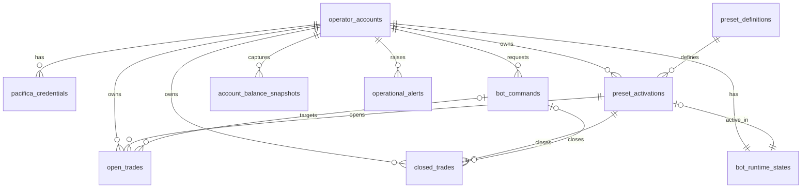

# Modelo Relacional do MVP

## Objetivo
Traduzir a modelagem de dados do produto para um modelo relacional inicial em PostgreSQL, servindo como base para schema, migrations e contratos de persistência.

## Escopo
Este documento cobre:
- tabelas principais do MVP
- colunas iniciais sugeridas
- chaves primárias e estrangeiras
- constraints principais
- índices recomendados
- regras de integridade

## Premissas Confirmadas
- uma conta possui apenas um preset ativo por vez no MVP
- os únicos campos editáveis do preset no MVP são `symbol`, `position size`, `long enabled` e `short enabled`
- `risk` é atributo de leitura do preset, não campo editável do MVP
- trades abertos e trades encerrados ficam em tabelas separadas
- comandos operacionais são persistidos para execução assíncrona
- credenciais Pacifica exigem armazenamento altamente seguro

## Convenções Recomendadas
- primary keys em `uuid`
- timestamps em `timestamptz`
- colunas monetárias em `numeric`
- enums de domínio em tipos controlados pela aplicação ou enums SQL quando estabilizados
- `created_at` e `updated_at` em tabelas mutáveis

## Tabelas Principais

### `operator_accounts`
Representa a conta principal do operador no produto.

Colunas sugeridas:
- `id` PK
- `wallet_address` unique not null
- `onboarding_status` not null
- `created_at` not null
- `updated_at` not null

### `pacifica_credentials`
Representa a credencial operacional da Pacifica vinculada à conta.

Colunas sugeridas:
- `id` PK
- `operator_account_id` FK not null
- `credential_alias` null
- `public_key` not null
- `encrypted_private_key_ref` not null
- `key_fingerprint` not null
- `validation_status` not null
- `last_validated_at` null
- `last_validation_error_code` null
- `created_at` not null
- `updated_at` not null

Regras:
- permitir uma ou mais versões históricas se necessário
- no MVP, pode haver uma credencial ativa por conta

### `preset_definitions`
Catálogo estático dos presets disponíveis.

Colunas sugeridas:
- `id` PK
- `name` not null
- `slug` unique not null
- `version` not null
- `risk_label` not null
- `frequency_label` not null
- `description` not null
- `base_contract_json` not null
- `is_active` not null
- `created_at` not null
- `updated_at` not null

### `preset_activations`
Representa a ativação concreta do preset para uma conta.

Colunas sugeridas:
- `id` PK
- `operator_account_id` FK not null
- `preset_definition_id` FK not null
- `activation_status` not null
- `symbol` not null
- `position_size_type` not null
- `position_size_value` not null
- `long_enabled` not null
- `short_enabled` not null
- `editable_config_json` null
- `effective_contract_json` not null
- `activated_at` null
- `deactivated_at` null
- `created_by` not null
- `created_at` not null
- `updated_at` not null

Regra crítica:
- apenas uma ativação em estado `active` por `operator_account_id`

### `bot_runtime_states`
Snapshot consolidado do estado do bot por conta.

Colunas sugeridas:
- `id` PK
- `operator_account_id` FK unique not null
- `bot_status` not null
- `pacifica_connection_status` not null
- `sync_status` not null
- `active_preset_activation_id` FK null
- `last_heartbeat_at` null
- `last_error_message` null
- `created_at` not null
- `updated_at` not null

### `bot_commands`
Fila lógica de comandos operacionais.

Colunas sugeridas:
- `id` PK
- `operator_account_id` FK not null
- `command_type` not null
- `target_type` null
- `target_id` null
- `payload_json` null
- `requested_by` not null
- `command_status` not null
- `idempotency_key` not null
- `requested_at` not null
- `started_at` null
- `finished_at` null
- `failure_reason` null
- `created_at` not null
- `updated_at` not null

Regra crítica:
- `idempotency_key` deve ser única por conta e tipo de comando, ou globalmente única, conforme estratégia escolhida

### `open_trades`
Trades atualmente abertos e exibidos no Dashboard e tela de Trades Atuais.

Colunas sugeridas:
- `id` PK
- `operator_account_id` FK not null
- `pacifica_trade_id` not null
- `preset_activation_id` FK null
- `symbol` not null
- `side` not null
- `entry_price` not null
- `current_price` not null
- `quantity` not null
- `capital_allocated` not null
- `unrealized_pnl` not null
- `trade_status` not null
- `opened_at` not null
- `close_requested_at` null
- `close_reason_pending` null
- `is_platform_trade` not null
- `last_synced_at` not null
- `created_at` not null
- `updated_at` not null

Regra crítica:
- `pacifica_trade_id` deve ser único por conta enquanto o trade estiver aberto

### `closed_trades`
Trades encerrados para leitura histórica.

Colunas sugeridas:
- `id` PK
- `operator_account_id` FK not null
- `pacifica_trade_id` not null
- `preset_activation_id` FK null
- `symbol` not null
- `side` not null
- `entry_price` not null
- `exit_price` not null
- `quantity` not null
- `capital_allocated` not null
- `realized_pnl` not null
- `close_reason` not null
- `opened_at` not null
- `closed_at` not null
- `is_platform_trade` not null
- `closed_by_command_id` FK null
- `last_synced_at` not null
- `created_at` not null

### `account_balance_snapshots`
Snapshot de saldo para leitura rápida.

Colunas sugeridas:
- `id` PK
- `operator_account_id` FK not null
- `total_balance` not null
- `available_balance` not null
- `aggregated_pnl` not null
- `capital_in_use` not null
- `captured_at` not null
- `created_at` not null

### `operational_alerts`
Alertas e mensagens operacionais relevantes para o Dashboard.

Colunas sugeridas:
- `id` PK
- `operator_account_id` FK not null
- `alert_type` not null
- `severity` not null
- `title` not null
- `message` not null
- `is_active` not null
- `created_at` not null
- `resolved_at` null

## Diagrama Relacional



## Chaves Estrangeiras
- `pacifica_credentials.operator_account_id -> operator_accounts.id`
- `preset_activations.operator_account_id -> operator_accounts.id`
- `preset_activations.preset_definition_id -> preset_definitions.id`
- `bot_runtime_states.operator_account_id -> operator_accounts.id`
- `bot_runtime_states.active_preset_activation_id -> preset_activations.id`
- `bot_commands.operator_account_id -> operator_accounts.id`
- `open_trades.operator_account_id -> operator_accounts.id`
- `open_trades.preset_activation_id -> preset_activations.id`
- `closed_trades.operator_account_id -> operator_accounts.id`
- `closed_trades.preset_activation_id -> preset_activations.id`
- `closed_trades.closed_by_command_id -> bot_commands.id`
- `account_balance_snapshots.operator_account_id -> operator_accounts.id`
- `operational_alerts.operator_account_id -> operator_accounts.id`

## Constraints Recomendadas

### Unicidade
- `operator_accounts.wallet_address` unique
- `preset_definitions.slug` unique
- `bot_runtime_states.operator_account_id` unique
- `bot_commands.idempotency_key` unique, ou unique composta se preferirmos escopo por conta

### Regra de preset ativo único
Implementar índice único parcial em `preset_activations`:

```sql
unique (operator_account_id)
where activation_status = 'active'
```

### Integridade de runtime
- `bot_runtime_states.active_preset_activation_id` deve apontar para uma ativação da mesma conta
- se `bot_status = 'active'`, idealmente deve existir `active_preset_activation_id`

### Integridade de trades
- trade aberto não pode coexistir como aberto e encerrado no mesmo estado lógico
- `closed_trades.closed_by_command_id` só deve ser preenchido quando o motivo de fechamento for manual

## Índices Recomendados

### `preset_activations`
- index por `operator_account_id`
- index por `activation_status`
- unique parcial para `active`

### `bot_commands`
- index por `command_status`
- index por `operator_account_id, requested_at desc`
- index por `target_type, target_id`

### `open_trades`
- index por `operator_account_id`
- index por `trade_status`
- index por `operator_account_id, opened_at desc`
- unique potencial em `operator_account_id, pacifica_trade_id`

### `closed_trades`
- index por `operator_account_id, closed_at desc`
- index por `preset_activation_id`
- index por `close_reason`

### `account_balance_snapshots`
- index por `operator_account_id, captured_at desc`

### `operational_alerts`
- index por `operator_account_id, is_active`
- index por `severity, created_at desc`

## Tipos de Dados Sugeridos
- `wallet_address`, `public_key`, `key_fingerprint`, `symbol`, `status`: `text`
- `base_contract_json`, `editable_config_json`, `effective_contract_json`, `payload_json`: `jsonb`
- preços, quantidades, pnl, capital: `numeric(24,8)` ou precisão equivalente
- timestamps: `timestamptz`

## Regras de Segurança para Credenciais
- `encrypted_private_key_ref` não deve guardar o segredo puro, apenas referência ou envelope criptográfico
- o segredo real deve ser protegido com KMS ou mecanismo equivalente
- acesso a credenciais deve ser restrito ao worker e ao fluxo controlado de validação
- nenhuma coluna deve armazenar private key em texto puro
- logs de persistência e erro não podem serializar material sensível

## Regras de Integridade de Negócio
- onboarding só pode chegar em `ready` quando houver wallet conectada, credencial válida e saldo inicial sincronizado
- uma conta sem credencial Pacifica válida não pode ter preset ativo
- uma conta não pode ter mais de um preset ativo no MVP
- um trade manualmente encerrado deve gerar `bot_command` associado quando a ação vier do usuário
- `position_size_value` deve refletir o campo editável permitido no MVP

## Pontos Ainda em Aberto
- se `pacifica_credentials` terá versionamento explícito ou apenas uma linha ativa por conta
- como `position size` será representado no contrato e persistência do MVP
- se `account_balance_snapshots` armazenará histórico completo ou será resumido por retenção
- se os status serão enums SQL ou apenas strings validadas na aplicação
- estratégia final de unicidade para `idempotency_key`

## Próximo Passo Recomendado
Depois deste documento, o próximo passo técnico é criar:
1. schema lógico inicial em Prisma
2. enums de domínio em `packages/contracts`
3. DTOs de leitura do Dashboard, Presets, Trades Atuais e Histórico
