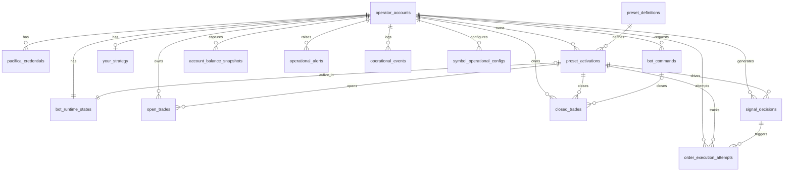

# Modelo Relacional — Estado Atual

## Objetivo
Documentar o modelo relacional real implementado em PostgreSQL via Prisma ORM, servindo como referência de verdade para schema, migrations e contratos de persistência.

> **Nota:** Este documento reflete o schema atual (`packages/database/prisma/schema.prisma`). Divergências entre este doc e o schema são erros de documentação — o schema é a fonte de verdade.

## Convenções
- primary keys em `uuid`
- timestamps em `timestamptz`
- colunas monetárias e de preço em `Decimal(24,8)`
- funding rate em `Decimal(18,12)` (precisão maior)
- leverage em `Decimal(12,4)`
- enums definidos em Prisma e espelhados em `packages/contracts`
- `created_at` e `updated_at` em tabelas mutáveis

---

## Enums de Domínio

### `OnboardingStatus`
```
wallet_pending | credentials_pending | credentials_validating | ready | blocked
```

### `CredentialValidationStatus`
```
pending | validating | valid | invalid | error
```

### `CredentialLifecycleStatus`
```
pending | active | replaced
```

### `BotStatus`
```
inactive | active | paused | syncing | error
```

### `PacificaConnectionStatus`
```
disconnected | connecting | connected | degraded | error
```

### `ExchangeSnapshotStatus`
```
confirmed | last_known
```

### `SyncStatus`
```
idle | syncing | healthy | degraded | error
```

### `PresetActivationStatus`
```
pending | active | paused | stopped | failed
```

### `PositionSizeType`
```
fixed_amount | balance_percent
```

### `CommandType`
```
validate_credentials | activate_preset | pause_bot | resume_bot | close_trade
```

### `SignalDecisionStatus`
```
pending | processing | completed | failed | cancelled
```

### `CommandStatus`
```
pending | running | completed | failed | cancelled
```

### `TargetType`
```
credential | preset_activation | trade | bot
```

### `TradeStatus`
```
open | close_requested | closing | sync_error
```

### `TradeSide`
```
long | short
```

### `CloseReason`
```
take_profit | stop_loss | manual | system | error
```

### `AlertType`
```
connection | runtime | reconciliation | command
```

### `AlertSeverity`
```
info | warning | error
```

### `OperationalEventType`
```
credential_validation | operational_verification | signal_evaluation |
order_execution | preset_activation | bot_command | runtime_reconciliation
```

### `OrderExecutionStatus`
```
pending | sent | failed
```

### `MarketSnapshotStatus`
```
confirmed | stale | unavailable
```

### `MarketPriceSource`
```
market | mark
```

---

## Modelos

### `operator_accounts`
Conta principal do operador. Ponto central do modelo — todas as entidades operacionais se vinculam aqui.

| Campo | Tipo | Constraints |
|-------|------|-------------|
| `id` | uuid | PK |
| `wallet_address` | text | unique not null |
| `onboarding_status` | OnboardingStatus | not null |
| `created_at` | timestamptz | not null |
| `updated_at` | timestamptz | not null |

---

### `pacifica_credentials`
Credencial operacional da Pacifica (agent wallet) vinculada à conta.

| Campo | Tipo | Constraints |
|-------|------|-------------|
| `id` | uuid | PK |
| `operator_account_id` | uuid | FK nullable (credencial pode existir antes de associação) |
| `wallet_address` | text | nullable |
| `credential_alias` | text | nullable |
| `public_key` | text | not null |
| `encrypted_private_key_ref` | text | not null (envelope AES, nunca plain text) |
| `key_fingerprint` | text | not null |
| `validation_status` | CredentialValidationStatus | not null |
| `lifecycle_status` | CredentialLifecycleStatus | not null, default `pending` |
| `operationally_verified` | boolean | not null, default false |
| `last_validated_at` | timestamptz | nullable |
| `last_validation_error_code` | text | nullable |
| `last_operational_verified_at` | timestamptz | nullable |
| `last_operational_error_code` | text | nullable |
| `last_operational_probe_json` | jsonb | nullable |
| `created_at` | timestamptz | not null |
| `updated_at` | timestamptz | not null |

Índices: `operator_account_id`, `wallet_address`, `(operator_account_id, lifecycle_status)`

Regras:
- `encrypted_private_key_ref` nunca armazena chave em texto puro
- credenciais antigas ficam com `lifecycle_status = replaced` para histórico
- acesso restrito ao worker e ao fluxo de validação da API

---

### `preset_definitions`
Catálogo de presets disponíveis (legado — presets pré-definidos foram removidos do produto; tabela mantida para compatibilidade e histórico).

| Campo | Tipo | Constraints |
|-------|------|-------------|
| `id` | uuid | PK |
| `name` | text | not null |
| `slug` | text | unique not null |
| `version` | int | not null |
| `risk_label` | text | not null |
| `frequency_label` | text | not null |
| `description` | text | not null |
| `base_contract_json` | jsonb | not null |
| `is_active` | boolean | not null |
| `created_at` | timestamptz | not null |
| `updated_at` | timestamptz | not null |

---

### `preset_activations`
Ativação concreta de uma estratégia para uma conta. Usado tanto para presets legados quanto para YOUR Strategy (via `preset_definition_id` apontando para definição virtual).

| Campo | Tipo | Constraints |
|-------|------|-------------|
| `id` | uuid | PK |
| `operator_account_id` | uuid | FK not null |
| `preset_definition_id` | uuid | FK not null |
| `activation_status` | PresetActivationStatus | not null |
| `symbol` | text | not null |
| `position_size_type` | PositionSizeType | not null |
| `position_size_value` | Decimal(24,8) | not null |
| `long_enabled` | boolean | not null |
| `short_enabled` | boolean | not null |
| `editable_config_json` | jsonb | nullable |
| `effective_contract_json` | jsonb | not null (contrato materializado final) |
| `activated_at` | timestamptz | nullable |
| `deactivated_at` | timestamptz | nullable |
| `created_by` | text | not null |
| `created_at` | timestamptz | not null |
| `updated_at` | timestamptz | not null |

Índices: `operator_account_id`, `activation_status`, `(operator_account_id, activation_status)`

Regra crítica: apenas uma ativação com `activation_status = active` por `operator_account_id`.

---

### `your_strategy`
Estratégia customizada criada do zero pelo usuário. Máximo de 1 por conta.

| Campo | Tipo | Constraints |
|-------|------|-------------|
| `id` | uuid | PK |
| `operator_account_id` | uuid | unique FK not null |
| `draft_json` | jsonb | not null (builder em edição) |
| `materialized_contract_json` | jsonb | nullable (PresetTechnicalContract gerado) |
| `activation_blockers_json` | jsonb | nullable (bloqueios para ativação) |
| `last_backtest_previewed_at` | timestamptz | nullable |
| `last_backtest_preview_fingerprint` | text | nullable |
| `created_at` | timestamptz | not null |
| `updated_at` | timestamptz | not null |

Índice: `operator_account_id`

Regras:
- `draft_json` persiste o estado atual do builder mesmo sem backtest
- `materialized_contract_json` só é gerado quando o draft é válido
- ativação exige backtest prévio com fingerprint correspondente

---

### `symbol_operational_configs`
Configuração operacional por símbolo por conta, populada pelo readiness check.

| Campo | Tipo | Constraints |
|-------|------|-------------|
| `id` | uuid | PK |
| `operator_account_id` | uuid | FK not null |
| `symbol` | text | not null |
| `leverage` | Decimal(12,4) | not null |
| `created_at` | timestamptz | not null |
| `updated_at` | timestamptz | not null |

Unique: `(operator_account_id, symbol)`. Índice: `operator_account_id`

Regra: criada/atualizada pelo `StartBotReadinessCheck` a cada execução bem-sucedida. Usada pelo worker para cálculo de sizing.

---

### `bot_runtime_states`
Snapshot consolidado do estado do bot por conta. Um registro por conta (1-to-1).

| Campo | Tipo | Constraints |
|-------|------|-------------|
| `id` | uuid | PK |
| `operator_account_id` | uuid | unique FK not null |
| `bot_status` | BotStatus | not null |
| `pacifica_connection_status` | PacificaConnectionStatus | not null |
| `sync_status` | SyncStatus | not null |
| `exchange_snapshot_status` | ExchangeSnapshotStatus | not null, default `last_known` |
| `exchange_last_synced_at` | timestamptz | nullable |
| `exchange_snapshot_message` | text | nullable |
| `active_preset_activation_id` | uuid | FK nullable |
| `worker_owner_id` | text | nullable (ID do worker com lease ativo) |
| `worker_lease_expires_at` | timestamptz | nullable |
| `worker_loop_started_at` | timestamptz | nullable |
| `last_heartbeat_at` | timestamptz | nullable |
| `last_signal_evaluation_at` | timestamptz | nullable |
| `last_signal_fingerprint` | text | nullable |
| `last_error_message` | text | nullable |
| `created_at` | timestamptz | not null |
| `updated_at` | timestamptz | not null |

Índice: `(worker_owner_id, worker_lease_expires_at)`

---

### `signal_decisions`
Decisão de sinal gerada pelo motor de estratégia. Inclui risk plan completo.

| Campo | Tipo | Constraints |
|-------|------|-------------|
| `id` | uuid | PK |
| `operator_account_id` | uuid | FK not null |
| `preset_activation_id` | uuid | FK not null |
| `signal_fingerprint` | text | not null (deduplicação) |
| `decision_status` | SignalDecisionStatus | not null |
| `signal_side` | TradeSide | not null |
| `symbol` | text | not null |
| `market_symbol` | text | not null |
| `timeframe` | text | not null |
| `price_source` | text | not null |
| `candle_open_time` | timestamptz | not null |
| `candle_close_time` | timestamptz | not null |
| `entry_reference_price` | Decimal(24,8) | not null |
| `stop_loss_price` | Decimal(24,8) | not null |
| `take_profit_price` | Decimal(24,8) | not null |
| `risk_distance` | Decimal(24,8) | not null |
| `payload_json` | jsonb | nullable |
| `requested_at` | timestamptz | not null |
| `created_at` | timestamptz | not null |
| `updated_at` | timestamptz | not null |

Índices: `decision_status`, `(operator_account_id, requested_at desc)`, `(preset_activation_id, requested_at desc)`, `(operator_account_id, signal_fingerprint, decision_status)`

Regra: `signal_fingerprint` = `[accountId, presetActivationId, signal, candleCloseTime, priceSource]` — impede ordens duplicadas para o mesmo sinal.

---

### `order_execution_attempts`
Tentativa de envio de ordem para a Pacifica. Rastreabilidade completa de request/response.

| Campo | Tipo | Constraints |
|-------|------|-------------|
| `id` | uuid | PK |
| `operator_account_id` | uuid | FK not null |
| `preset_activation_id` | uuid | FK not null |
| `signal_decision_id` | uuid | FK not null |
| `execution_status` | OrderExecutionStatus | not null |
| `client_order_id` | text | unique not null |
| `signal_fingerprint` | text | not null |
| `symbol` | text | not null |
| `market_symbol` | text | not null |
| `order_side` | TradeSide | not null |
| `requested_notional_usd` | Decimal(24,8) | not null |
| `requested_quantity` | Decimal(24,8) | not null |
| `entry_reference_price` | Decimal(24,8) | not null |
| `slippage_percent` | Decimal(24,8) | not null |
| `request_json` | jsonb | nullable |
| `response_json` | jsonb | nullable |
| `failure_reason` | text | nullable |
| `retryable_failure` | boolean | not null, default false |
| `pacifica_order_id` | text | nullable |
| `requested_at` | timestamptz | not null |
| `finished_at` | timestamptz | nullable |
| `created_at` | timestamptz | not null |
| `updated_at` | timestamptz | not null |

Índices: `(operator_account_id, requested_at desc)`, `(signal_decision_id, requested_at desc)`, `(execution_status, requested_at desc)`

---

### `bot_commands`
Fila lógica de comandos operacionais assíncronos.

| Campo | Tipo | Constraints |
|-------|------|-------------|
| `id` | uuid | PK |
| `operator_account_id` | uuid | FK not null |
| `command_type` | CommandType | not null |
| `target_type` | TargetType | nullable |
| `target_id` | uuid | nullable |
| `payload_json` | jsonb | nullable |
| `requested_by` | text | not null |
| `command_status` | CommandStatus | not null |
| `idempotency_key` | text | unique not null |
| `requested_at` | timestamptz | not null |
| `started_at` | timestamptz | nullable |
| `finished_at` | timestamptz | nullable |
| `failure_reason` | text | nullable |
| `created_at` | timestamptz | not null |
| `updated_at` | timestamptz | not null |

Índices: `command_status`, `(operator_account_id, requested_at desc)`, `(target_type, target_id)`

---

### `open_trades`
Trades atualmente abertos.

| Campo | Tipo | Constraints |
|-------|------|-------------|
| `id` | uuid | PK |
| `operator_account_id` | uuid | FK not null |
| `pacifica_trade_id` | text | not null |
| `preset_activation_id` | uuid | FK nullable |
| `stop_loss_price` | Decimal(24,8) | nullable |
| `take_profit_price` | Decimal(24,8) | nullable |
| `entry_client_order_id` | text | nullable |
| `pacifica_order_id` | text | nullable |
| `symbol` | text | not null |
| `side` | TradeSide | not null |
| `entry_price` | Decimal(24,8) | not null |
| `current_price` | Decimal(24,8) | not null |
| `quantity` | Decimal(24,8) | not null |
| `capital_allocated` | Decimal(24,8) | not null |
| `unrealized_pnl` | Decimal(24,8) | not null |
| `trade_status` | TradeStatus | not null |
| `opened_at` | timestamptz | not null |
| `close_requested_at` | timestamptz | nullable |
| `close_reason_pending` | CloseReason | nullable |
| `is_platform_trade` | boolean | not null |
| `last_synced_at` | timestamptz | not null |
| `created_at` | timestamptz | not null |
| `updated_at` | timestamptz | not null |

Unique: `(operator_account_id, pacifica_trade_id)`. Índices: `operator_account_id`, `trade_status`, `(operator_account_id, opened_at desc)`

---

### `closed_trades`
Trades encerrados para histórico.

| Campo | Tipo | Constraints |
|-------|------|-------------|
| `id` | uuid | PK |
| `operator_account_id` | uuid | FK not null |
| `pacifica_trade_id` | text | not null |
| `preset_activation_id` | uuid | FK nullable |
| `symbol` | text | not null |
| `side` | TradeSide | not null |
| `entry_price` | Decimal(24,8) | not null |
| `exit_price` | Decimal(24,8) | not null |
| `quantity` | Decimal(24,8) | not null |
| `capital_allocated` | Decimal(24,8) | not null |
| `realized_pnl` | Decimal(24,8) | not null |
| `close_reason` | CloseReason | not null |
| `opened_at` | timestamptz | not null |
| `closed_at` | timestamptz | not null |
| `is_platform_trade` | boolean | not null |
| `closed_by_command_id` | uuid | FK nullable |
| `last_synced_at` | timestamptz | not null |
| `created_at` | timestamptz | not null |

Índices: `(operator_account_id, closed_at desc)`, `preset_activation_id`, `close_reason`

---

### `account_balance_snapshots`
Snapshot de saldo para leitura rápida.

| Campo | Tipo | Constraints |
|-------|------|-------------|
| `id` | uuid | PK |
| `operator_account_id` | uuid | FK not null |
| `total_balance` | Decimal(24,8) | not null |
| `available_balance` | Decimal(24,8) | not null |
| `aggregated_pnl` | Decimal(24,8) | not null |
| `capital_in_use` | Decimal(24,8) | not null |
| `captured_at` | timestamptz | not null |
| `created_at` | timestamptz | not null |

Índice: `(operator_account_id, captured_at desc)`

---

### `operational_alerts`
Alertas operacionais ativos ou resolvidos por conta.

| Campo | Tipo | Constraints |
|-------|------|-------------|
| `id` | uuid | PK |
| `operator_account_id` | uuid | FK not null |
| `alert_type` | AlertType | not null |
| `severity` | AlertSeverity | not null |
| `title` | text | not null |
| `message` | text | not null |
| `is_active` | boolean | not null |
| `created_at` | timestamptz | not null |
| `resolved_at` | timestamptz | nullable |

Índices: `(operator_account_id, is_active)`, `(severity, created_at desc)`

---

### `operational_events`
Log de auditoria imutável de eventos operacionais do sistema.

| Campo | Tipo | Constraints |
|-------|------|-------------|
| `id` | uuid | PK |
| `operator_account_id` | uuid | FK nullable |
| `wallet_address` | text | nullable (para eventos pré-associação de conta) |
| `event_type` | OperationalEventType | not null |
| `severity` | AlertSeverity | not null |
| `title` | text | not null |
| `message` | text | not null |
| `payload_json` | jsonb | nullable |
| `created_at` | timestamptz | not null |

Índices: `(operator_account_id, created_at desc)`, `(wallet_address, created_at desc)`, `(event_type, created_at desc)`

---

### `market_price_current`
Snapshot mais recente de preço por símbolo. PK é o próprio símbolo (upsert).

| Campo | Tipo | Constraints |
|-------|------|-------------|
| `symbol` | text | PK |
| `mark_price` | Decimal(24,8) | not null |
| `index_price` | Decimal(24,8) | nullable |
| `last_price` | Decimal(24,8) | nullable |
| `volume_24h` | Decimal(24,8) | nullable |
| `open_interest` | Decimal(24,8) | nullable |
| `funding_rate` | Decimal(18,12) | nullable |
| `captured_at` | timestamptz | not null |
| `fetched_at` | timestamptz | not null |
| `snapshot_status` | MarketSnapshotStatus | not null, default `confirmed` |
| `source` | text | not null |
| `created_at` | timestamptz | not null |
| `updated_at` | timestamptz | not null |

Índice: `fetched_at desc`

---

### `market_candle_snapshots`
OHLCV de candles por símbolo, intervalo e fonte de preço.

| Campo | Tipo | Constraints |
|-------|------|-------------|
| `id` | uuid | PK |
| `symbol` | text | not null |
| `interval` | text | not null |
| `price_source` | MarketPriceSource | not null |
| `open_time` | timestamptz | not null |
| `close_time` | timestamptz | not null |
| `open` | Decimal(24,8) | not null |
| `high` | Decimal(24,8) | not null |
| `low` | Decimal(24,8) | not null |
| `close` | Decimal(24,8) | not null |
| `volume` | Decimal(24,8) | not null |
| `fetched_at` | timestamptz | not null |
| `snapshot_status` | MarketSnapshotStatus | not null, default `confirmed` |
| `source` | text | not null |
| `created_at` | timestamptz | not null |

Unique: `(symbol, interval, price_source, open_time)`. Índices: `(symbol, interval, price_source, open_time desc)`, `fetched_at desc`

---

### `market_info_current`
Metadados do mercado por símbolo (tick size, lot size, leverage, etc.). PK é o símbolo.

| Campo | Tipo | Constraints |
|-------|------|-------------|
| `symbol` | text | PK |
| `tick_size` | Decimal(24,8) | not null |
| `lot_size` | Decimal(24,8) | not null |
| `min_order_size` | Decimal(24,8) | not null |
| `max_order_size` | Decimal(24,8) | nullable |
| `max_leverage` | Decimal(18,8) | nullable |
| `fetched_at` | timestamptz | not null |
| `snapshot_status` | MarketSnapshotStatus | not null, default `confirmed` |
| `source` | text | not null |
| `created_at` | timestamptz | not null |
| `updated_at` | timestamptz | not null |

Índice: `fetched_at desc`

---

### `market_refresh_logs`
Log das execuções do scheduler de market data.

| Campo | Tipo | Constraints |
|-------|------|-------------|
| `id` | uuid | PK |
| `refresh_type` | text | not null |
| `refresh_key` | text | not null |
| `started_at` | timestamptz | not null |
| `finished_at` | timestamptz | nullable |
| `status` | text | not null |
| `error_message` | text | nullable |
| `records_written` | int | not null, default 0 |
| `created_at` | timestamptz | not null |

Índices: `(refresh_type, started_at desc)`, `(refresh_key, started_at desc)`

---

## Diagrama Relacional



---

## Regras de Integridade de Negócio

- conta sem credencial Pacifica válida (`lifecycle_status = active`, `operationally_verified = true`) não pode ter preset ativo
- apenas uma ativação `active` por `operator_account_id` (garantido por índice + regra de aplicação)
- apenas um `YourStrategy` por conta (`unique operator_account_id`)
- ativação de `YourStrategy` exige `last_backtest_preview_fingerprint` correspondente ao draft
- `bot_runtime_states` é criado automaticamente na primeira interação com a conta
- `worker_lease_expires_at` deve ser > now para o worker operar a conta
- `closed_by_command_id` só preenchido quando `close_reason = manual`
- nenhuma coluna de credencial armazena private key em texto puro
- `signal_fingerprint` garante idempotência na geração de ordens
- `StartBotReadinessCheck` deve ser executado antes de qualquer `resume_bot`

## Regras de Segurança para Credenciais

- `encrypted_private_key_ref` armazena apenas o envelope AES — nunca a chave em texto puro
- a chave de criptografia AES (`CREDENTIAL_ENCRYPTION_KEY`) deve ser gerenciada via KMS em produção
- acesso restrito ao worker e ao fluxo controlado de validação/operação da API
- logs nunca serializam material sensível (chaves, payloads de ordem, probe responses completos)
